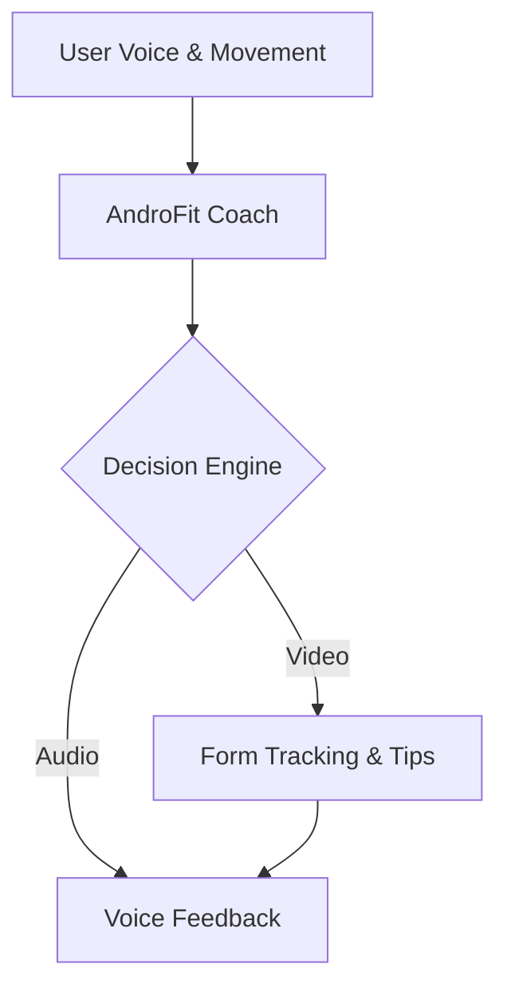
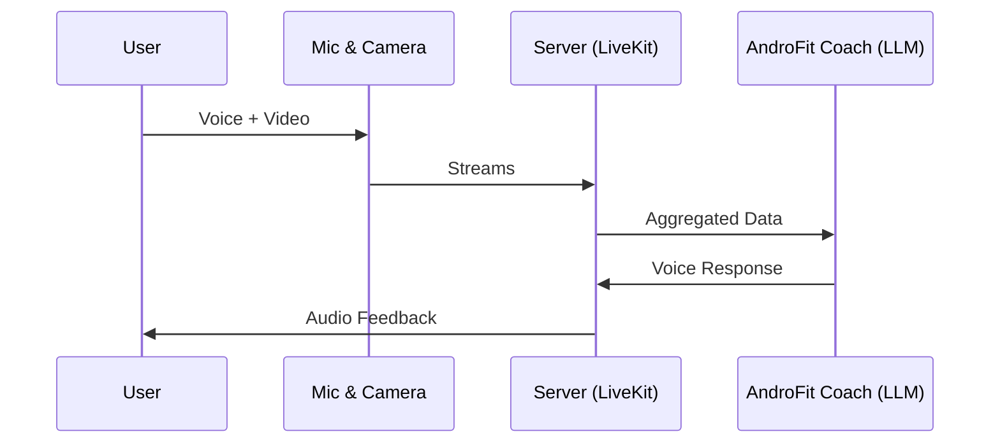
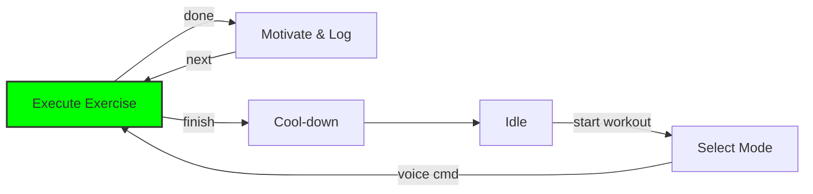
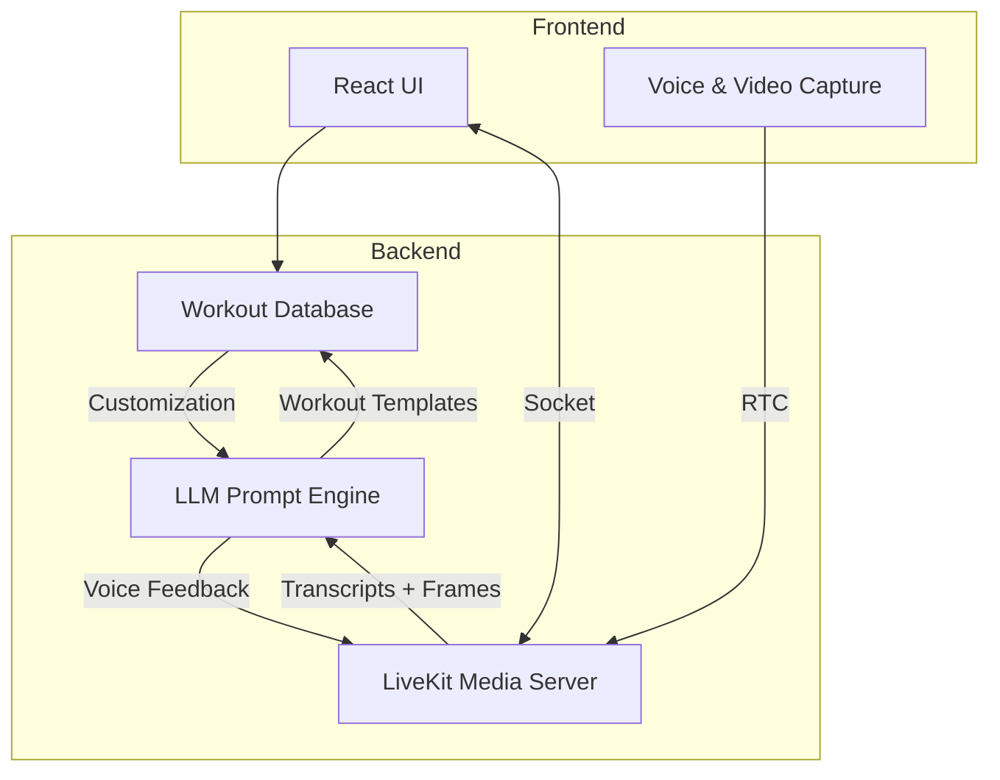

# AndroFit Coach – AI Voice & Vision Personal Trainer

---

🔹 **1. Concept Overview**

AndroFit Coach brings the energy of a real-life personal trainer straight to your headphones and webcam. Using state-of-the-art voice recognition and computer-vision form tracking, the agent listens to your commands (e.g., "Start leg day", "Switch to cardio"), watches your movements through any laptop or phone camera, and delivers instant, upbeat coaching. It calls out reps, corrects posture, and keeps you motivated with personalised banter and smart progressions.

By freeing you from staring at a screen or scrolling an app, AndroFit Coach creates a truly hands-free workout. Whether you need a gentle stretch after sitting all day or a high-intensity HIIT blast, the trainer adapts on-the-fly to fatigue, equipment on hand, or sudden changes of plan. A unique highlight is its Vision Feedback Loop: as soon as the camera detects form breakdown (knees caving in a squat, hips sagging in a plank) the coach corrects you verbally in <0.5 s, just like a pro in the gym.

Additional built-in perks include multilingual support (10+ languages), automatic playlist curation from Spotify/Apple Music to match workout tempo, and weekly progress snapshots delivered to your inbox. The result is an engaging, personalised and science-driven fitness experience—no human trainer required.

---

🔹 **2. Prompt Engineering Plan**

### A. Strategy
1. **Intent Detection** – A system prompt instructs the LLM to recognise workout intents (start, stop, switch, modify intensity) plus FAQ queries.
2. **Dynamic Response Templates** – Chat context variables feed the user's goals, fatigue level, equipment list and language preference.
3. **Adjustable Persona** – A `coach_mode` parameter toggles between *Drill-Sergeant*, *Chill Buddy* and *Physio-Focus* tones while preserving safety guidance.

### B. Example Prompts
| Prompt | Purpose |
| --- | --- |
| *"You are an AI personal trainer. The user says: 'Start a 15-minute cardio workout.' Respond cheerfully with 3 beginner exercises and a quick warm-up."* | Tests plan-generation & friendly tone |
| *"User: 'I can't do this anymore!'*" | Evaluates motivational empathy & adaptive scaling |
| *"User: 'How do I do a plank correctly?'*" | Checks concise, safety-first form instruction |

### C. Prompt Path (Recipe)

1. *System*: "Act as AndroFit Coach, an energetic yet safe fitness trainer."
2. *Behavioral*: "Reply in the tone defined by `coach_mode`."
3. *Safety*: "If unsure of user's health status, recommend consulting a professional."
4. *Recovery*: "If input unclear, ask a clarifying question within one short sentence."

---

🔹 **3. Relevance to AndroFit AI**

[AndroFit AI](https://androfit.co.uk/) is on a mission to make *healthy living 100 × more affordable* by replacing £100/hr trainers with a £1/hr AI coach. Our voice-first agent amplifies this vision:

• **Real-time posture analytics** – The camera-based Vision Feedback Loop detects and fixes form errors instantly, mirroring the website's promise of "real-time posture correction and conversations."

• **Holistic wellness layer** – Beyond reps, the coach can talk nutrition, recovery and mental-health check-ins, matching AndroFit's goal of *comprehensive wellness monitoring*.

• **Progress & insight engine** – Each session is logged for reps, sets, weight, efficiency and stamina, feeding the same advanced metrics users see in the platform's demo video.

• **Hands-free accessibility** – Voice guidance lets members move freely without screens or special equipment—perfect for crowded gyms or small flats.

By fusing these capabilities, AndroFit Coach positions the company to seize a share of the £2 billion UK fitness boom while fulfilling its pledge to make expert coaching accessible "for everyone, everywhere."

---

*Crafted with ❤️ for the AndroFit team – let's redefine workouts together!* 